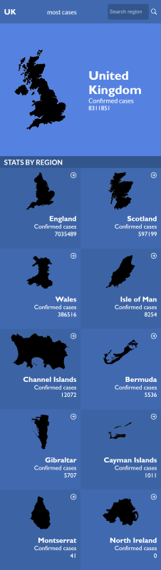

# Covid-19 Metrics Web App

> This is the capstone project from the third module of the Microverse Program.

Covid-19 Metrics is an API based web app that fetches information about covid-19 cases in the United Kingdom and renders this information in a UI. It's **Home** page displays confirmed cases for the United Kingdom and its regions. Each region has a **Details** page to which you can navigate by clicking on the region cards displayed in the **Home** page. When you navigate to one of the region details pages, the app will render more specific details for that particular region. Region details include information like confirmed cases, deaths, and recovered patients.

## Built With

- JavaScript
- React-Redux

## Live Demo

[Live Demo Link](https://rpire.github.io/covid-metrics/)

## Loom Video

[Loom Video Link](https://www.loom.com/share/7b3c1779d72a4ec5ac60c28778f2064e)

## Getting Started

To get a local copy up and running follow these simple example steps.

### Get the repository into your PC.
- Clone this repository using this URL `https://github.com/rpire/covid-metrics.git` or download it as a ZIP from the "Code" tab and extract the files.

### Usage
- Once get the repository in your PC. Navigate to it running `cd covid-metrics/`.
- Make sure to checkout to the desired branch running `git checkout {BRANCH_NAME}` on your terminal.
- Run `npm install` on the terminal to install the project dependencies.
- Run `npm run start` to see the web app running in your browser.

## Authors

👤 **Rubén D. Pire L.**

- GitHub: [@rpire](https://github.com/rpire)
- Twitter: [@RubenPire7](https://twitter.com/RubenPire7)
- LinkedIn: [Rubén Darío Pire López](https://www.linkedin.com/in/ruben-d-pire/)

## 🤝 Contributing

Contributions, issues, and feature requests are welcome!

Feel free to check the [issues page](../../issues/).

## Show your support

Give a ⭐️ if you like this project!

## Acknowledgments

- To [Nelson Sakwa](https://www.behance.net/sakwadesignstudio), since the whole website is based on his design.

## 📝 License

This project is [MIT](./LICENSE) licensed.
